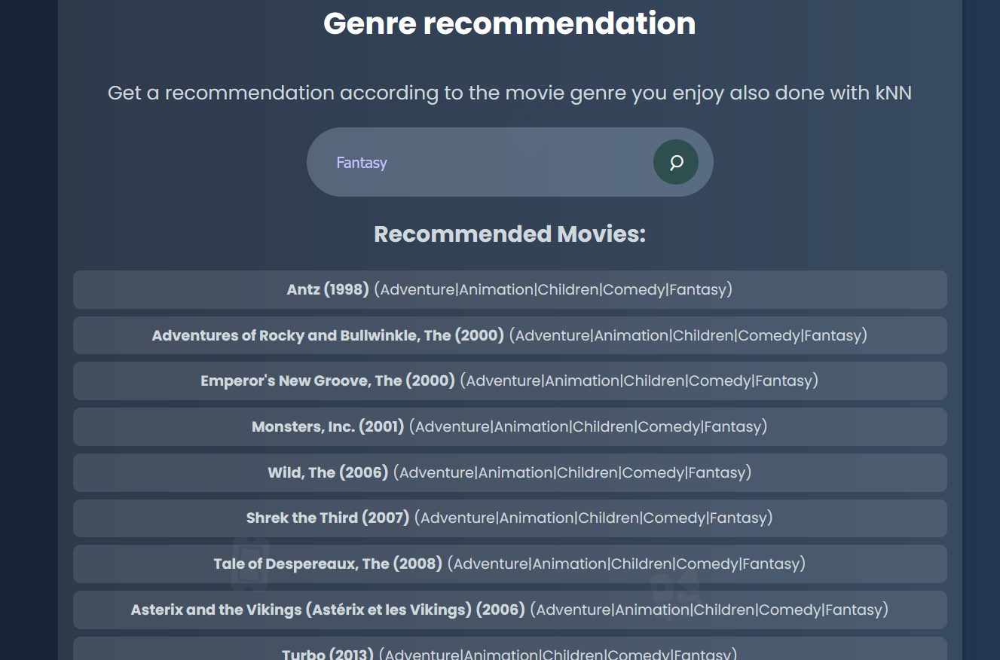

## Movie Recommendation System

### About
This project focuses on developing a movie recommendation system using various data science and machine learning techniques. Dataset used in the project can be found on: https://grouplens.org/datasets/movielens/ although movielens dataset was generated on 26 September 26, 2018 it includes data about 9742 movies. Besides juptyer file project offers a system built using Python and Flask, with web interface, which provides recommendations based on different algorithms.

### Features
Jupyter file leverages machine learning techniques to analyze user preferences and movie features. Below are the key components: 

1. Generic Recommendation:
- Method: Calculates the average rating of movies that have been rated by a specified minimum number of users.
- Implementationwith basic statistical: methods to filter and sort movies based on user ratings.
2. Advanced Recommendations:
- Data Cleaning: Noise reduction by removing users with few ratings and movies rated by few users to enhance recommendation quality as well as creating new data from to map user ratings to movies, filling missing values with zeroes.
- Collaborative Filtering: Uses cosine similarity to find similar users and recommend movies they liked.
- k-Nearest Neighbors (kNN): Item-based collaborative filtering to recommend movies similar to a user-rated movie or based on movie genres.
- Term Frequency - Inverse Document Frequency (TF-IDF): Utilizes content-based filtering alorithm to recommend movies based on the similarity of their titles and other content features.
3. EDA
- Data Visualization: plots and histograms visualizing information about users, movie genres, etc.

**Flask Integration**
As mentioned previously the project includes a Flask web application that allows users to interact with the recommendation systems directly from a web browser with the following features:

1. Generic Movie Recommendation:
- Get a list of movies based on the most rated and highest-scored movies by setting a minimum rating threshold
2. TF-IDF Based Recommendation:
- Get recommendation for movies similar to a specified title/keyword using TF-IDF and cosine similarity
- Recommends movies similar to the one entered in the search bar using the TF-IDF algorithm, searching across all movies
3. kNN genre-Based Recommendation:
- Recommend movies based on a specified genre using the kNN algorithm.
4. Autocomplete functionality:
- Suggests movie titles and genres as you type
5. Background animation and searchbar transition:
- The project includes aesthetic cinema-themed background animation as well as a simple button transitions to enhance the user experience
6. Responsive Design: 
- The web interface is fully responsive and works seamlessly across different devices and screen sizes.

### Usage and installation
1. Clone the repo
2. Create and activate a virtual environment:
```bash
    python -m venv env
    env\Scripts\activate
```
3. Install necessary dependencies:
- Install requirements:
```bash
    pip install -r requirements.txt
```
- And download the dataset from the MovieLens website and place the CSV files in the data/ directory

4. Run the Flask application:
```bash
python app.py
```
- And open index.html in your preferred web browser

5. Run jupyter notebook file:
```bash
jupyter notebook recommendation_system.ipynb
```
### Examples
Below are screens showcasing some of the project and its features:

<figure>
    
    <figcaption>Autocomplete feature (available in all recommendation searchbars)</figcaption>
</figure>

<figure>
    
    <figcaption>Results for TF-IDF recommendation</figcaption>
</figure>

<figure>
    
    <figcaption>Some of the recommendation results for 'Fantasy' movie genre</figcaption>
</figure>


#### Future updates
- Further refine machine learning models to enhance recommendation accuracy.

README will be updated if necessary